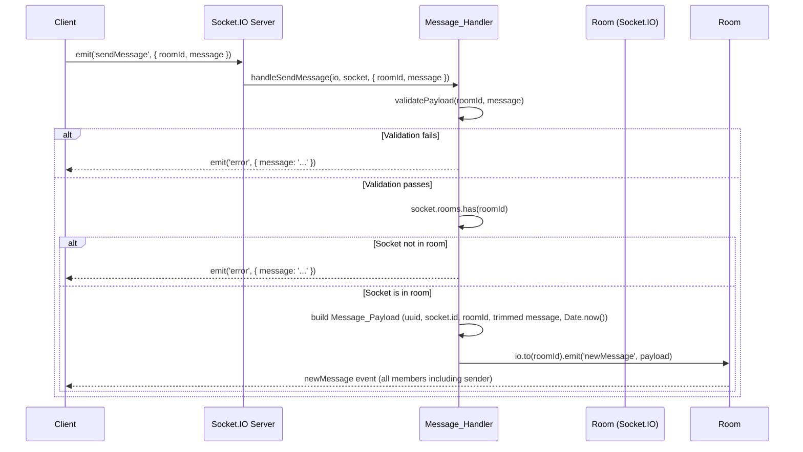

# Design Document: Message Broadcasting

## Overview

This feature adds real-time message broadcasting to the chat server. A client emits a `sendMessage` event carrying `{ roomId, message }`. The server validates the payload, confirms the socket is a member of the target room, constructs a canonical `Message_Payload`, and broadcasts a `newMessage` event to every socket in that room (including the sender) via `io.to(roomId).emit`. No persistence layer is involved — this is a pure in-memory broadcast built on top of Socket.IO's room mechanism established by the `room-management` feature.

The implementation follows the same module pattern as `roomHandler.js`: a dedicated `messageHandler.js` module exports a `registerMessageHandlers(io, socket)` function that is called from the existing `socket/index.js` initializer.

## Architecture



The handler has no dependency on Redis — it reads only `socket.rooms` (a native Socket.IO `Set`) and calls `io.to(roomId).emit`. This keeps the module stateless and easy to unit-test with simple mocks.

## Components and Interfaces

### `server/src/socket/messageHandler.js` (new file)

```
validatePayload(roomId, message) → { valid: boolean, error?: string }
handleSendMessage(io, socket, { roomId, message }) → void
registerMessageHandlers(io, socket) → void
```

**`validatePayload(roomId, message)`**
- Returns `{ valid: false, error: '...' }` if:
  - `roomId` is not a string, or `roomId.trim()` is empty
  - `message` is not a string, or `message.trim()` is empty
  - `message.trim().length > 2000`
- Returns `{ valid: true }` otherwise

**`handleSendMessage(io, socket, { roomId, message })`**
1. Call `validatePayload(roomId, message)`. If invalid, call `socket.emit('error', { message: result.error })` and return.
2. Call `socket.rooms.has(roomId)`. If false, call `socket.emit('error', { message: 'Not a member of room' })` and return.
3. Build the `Message_Payload`:
   ```js
   {
     messageId: uuidv4(),
     senderId: socket.id,
     roomId,
     message: message.trim(),
     timestamp: Date.now()
   }
   ```
4. Wrap `io.to(roomId).emit('newMessage', payload)` in a try/catch. On catch, log the error with `{ roomId, socketId: socket.id }` context and call `socket.emit('error', { message: 'Broadcast failed' })`.

**`registerMessageHandlers(io, socket)`**
- Registers a single `sendMessage` listener on `socket` that delegates to `handleSendMessage`.

### `server/src/socket/index.js` (modified)

Import `registerMessageHandlers` from `./messageHandler` and call it inside `io.on('connection', (socket) => { ... })` alongside the existing `registerRoomHandlers` call.

## Data Models

### `sendMessage` Client Event Payload

```js
{
  roomId: string,   // non-empty, identifies the target room
  message: string   // non-empty after trim, max 2000 chars after trim
}
```

### `newMessage` Server Broadcast Payload (`Message_Payload`)

```js
{
  messageId: string,   // UUID v4, generated server-side
  senderId:  string,   // socket.id of the sending socket
  roomId:    string,   // echoed from the validated sendMessage payload
  message:   string,   // trimmed text from the sendMessage payload
  timestamp: number    // Date.now() at broadcast time (Unix ms)
}
```

### `error` Server Event Payload (on rejection)

```js
{
  message: string   // human-readable description of the failure reason
}
```

## Correctness Properties

*A property is a characteristic or behavior that should hold true across all valid executions of a system — essentially, a formal statement about what the system should do. Properties serve as the bridge between human-readable specifications and machine-verifiable correctness guarantees.*

### Property 1: Valid messages are always broadcast

*For any* non-empty `roomId` string and non-empty `message` string whose trimmed length is ≤ 2000, when the socket is a member of the target room, `io.to(roomId).emit('newMessage', payload)` SHALL be called exactly once.

**Validates: Requirements 1.1, 1.2**

### Property 2: Invalid payloads are always rejected without broadcast

*For any* `sendMessage` payload where `roomId` is not a non-empty string, or `message` is not a non-empty string, or `message.trim().length > 2000`, the handler SHALL emit an `error` event to the sender and SHALL NOT call `io.to().emit`.

**Validates: Requirements 2.1, 2.2, 2.3, 2.4, 2.5**

### Property 3: Non-member sockets are rejected without broadcast

*For any* valid `sendMessage` payload where `socket.rooms.has(roomId)` returns false, the handler SHALL emit an `error` event to the sender and SHALL NOT call `io.to().emit`.

**Validates: Requirements 3.1, 3.2**

### Property 4: Broadcast payload is complete and well-formed

*For any* valid `sendMessage` payload that results in a successful broadcast, the `newMessage` payload SHALL contain:
- `messageId` matching the UUID v4 format (`/^[0-9a-f]{8}-[0-9a-f]{4}-4[0-9a-f]{3}-[89ab][0-9a-f]{3}-[0-9a-f]{12}$/i`)
- `senderId` equal to `socket.id`
- `roomId` equal to the input `roomId`
- `message` equal to `message.trim()`
- `timestamp` that is a positive integer

**Validates: Requirements 4.1, 4.2, 4.3, 4.4, 4.5**

### Property 5: Error events always carry a non-empty message string

*For any* rejection scenario (invalid payload or socket not in room), the `error` event emitted to the sender SHALL have a `message` field that is a non-empty string.

**Validates: Requirements 5.1**

### Property 6: Handler never throws unhandled exceptions

*For any* input (valid or invalid, any type), calling `handleSendMessage` SHALL NOT throw an unhandled exception.

**Validates: Requirements 5.2**

### Property 7: Redis is never called

*For any* `sendMessage` payload (valid or invalid), the handler SHALL NOT invoke any method on a Redis client.

**Validates: Requirements 1.4**

## Property Reflection

After reviewing the seven properties above:

- Properties 2 and 3 are distinct: Property 2 covers payload shape failures, Property 3 covers membership failures. They cannot be merged because the conditions and code paths differ.
- Property 4 subsumes individual field checks (4.1–4.5 from prework) into one comprehensive payload completeness property, eliminating five separate redundant properties.
- Property 1 and Property 4 are complementary, not redundant: Property 1 verifies the broadcast is called; Property 4 verifies the content of what is broadcast.
- Property 7 (no Redis calls) is unique and not implied by any other property.

No further consolidation is needed.

## Error Handling

| Condition | Response |
|---|---|
| `roomId` missing or not a string | `socket.emit('error', { message: 'roomId must be a non-empty string' })` |
| `roomId` empty after trim | `socket.emit('error', { message: 'roomId must be a non-empty string' })` |
| `message` missing or not a string | `socket.emit('error', { message: 'message must be a non-empty string' })` |
| `message` empty or whitespace-only after trim | `socket.emit('error', { message: 'message must be a non-empty string' })` |
| `message.trim().length > 2000` | `socket.emit('error', { message: 'message exceeds maximum length of 2000 characters' })` |
| Socket not in target room | `socket.emit('error', { message: 'You are not a member of this room' })` |
| Unexpected broadcast error | Log error with context; `socket.emit('error', { message: 'Broadcast failed' })` |

All error paths return immediately after emitting the error event. No partial state is modified.

## Testing Strategy

### Unit Tests (Jest)

Unit tests use manual mocks for `io` and `socket`. They cover:

- `validatePayload`: specific valid and invalid inputs (empty string, whitespace, non-string types, boundary lengths of 2000 and 2001 chars)
- `handleSendMessage` happy path: valid payload + socket in room → `io.to(roomId).emit` called with correct payload shape
- `handleSendMessage` error paths: each validation failure and the non-member case → `socket.emit('error')` called, `io.to().emit` not called
- Unexpected broadcast error: `io.to().emit` throws → error logged, `socket.emit('error')` called

### Property-Based Tests (fast-check, minimum 100 iterations each)

Property tests use `fast-check` to generate random inputs and verify universal properties. Each test is tagged with its design property number.

- **Property 1** — `fc.string({ minLength: 1 })` for roomId and message (trimmed length ≤ 2000); mock `socket.rooms.has` to return true; assert `io.to(roomId).emit` called once.
- **Property 2** — `fc.oneof(fc.constant(null), fc.constant(undefined), fc.integer(), fc.constant(''), fc.string().map(s => ' '.repeat(s.length)))` for invalid roomId/message; assert `socket.emit('error')` called and `io.to().emit` not called.
- **Property 3** — `fc.string({ minLength: 1 })` for valid roomId/message; mock `socket.rooms.has` to return false; assert `socket.emit('error')` called and `io.to().emit` not called.
- **Property 4** — `fc.string({ minLength: 1, maxLength: 2000 })` for message; capture broadcast payload; assert all five fields are present and well-formed.
- **Property 5** — All rejection scenarios; capture error event payload; assert `payload.message` is a non-empty string.
- **Property 6** — `fc.anything()` for both roomId and message; assert `handleSendMessage` does not throw.
- **Property 7** — Valid and invalid payloads; pass a mock redis object; assert no methods on it are called.

Tag format for each property test: `// Feature: message-broadcasting, Property N: <property_text>`
