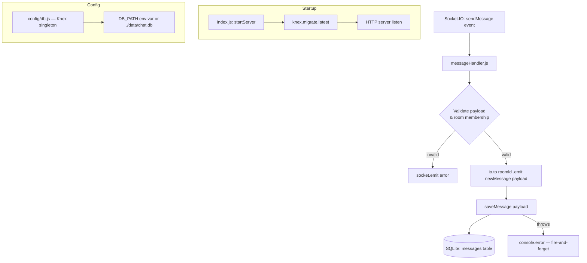

# Design Document: Message Persistence

## Overview

This feature adds a SQLite persistence layer to the chat server using **Knex** as the query builder and **better-sqlite3** as the driver. Every message that is successfully broadcast via `io.to(roomId).emit('newMessage', payload)` is written to a `messages` table. A `users` table is also created now to support the upcoming JWT authentication feature (Commit 5), but no user CRUD logic is implemented here.

The design follows a fire-and-forget pattern: the broadcast always completes first, and any database write failure is logged but never surfaced to the client. This keeps the real-time path fast and resilient to transient database errors.

**Stack additions:**
- `knex` — SQL query builder and migration runner
- `better-sqlite3` — synchronous SQLite3 driver (Knex dialect: `better-sqlite3`)

---

## Architecture



The persistence layer is entirely server-side. The client never knows whether a message was persisted — it only receives the `newMessage` broadcast.

---

## Components and Interfaces

### `server/src/config/db.js` — Knex Singleton

Creates and exports a single Knex instance. All other modules import this singleton.

```js
// server/src/config/db.js
const knex = require('knex')
const path = require('path')
const config = require('./env')

const db = knex({
  client: 'better-sqlite3',
  connection: {
    filename: config.dbPath,  // resolved from DB_PATH env var or default
  },
  useNullAsDefault: true,
})

module.exports = db
```

`config.dbPath` is added to `server/src/config/env.js`:

```js
dbPath: process.env.DB_PATH || path.resolve(__dirname, '../../data/chat.db'),
```

### `server/src/db/migrations/` — Migration Files

Knex migration files are stored here. A single initial migration creates both tables.

**Migration: `20240101000000_create_users_and_messages.js`**

```js
exports.up = async (knex) => {
  await knex.schema.createTable('users', (t) => {
    t.text('id').primary()           // UUID v4
    t.text('username').notNullable().unique()
    t.text('password_hash').notNullable()
    t.integer('created_at').notNullable()  // Unix ms
  })

  await knex.schema.createTable('messages', (t) => {
    t.text('id').primary()           // UUID v4 = messageId from broadcast
    t.text('room_id').notNullable()
    t.text('sender_id').notNullable()
    t.text('message').notNullable()
    t.integer('created_at').notNullable()  // Unix ms = timestamp from broadcast
  })
}

exports.down = async (knex) => {
  await knex.schema.dropTableIfExists('messages')
  await knex.schema.dropTableIfExists('users')
}
```

Knex requires a `knexfile.js` (or inline config) to locate migrations. The migration directory is configured on the DB singleton:

```js
const db = knex({
  client: 'better-sqlite3',
  connection: { filename: config.dbPath },
  useNullAsDefault: true,
  migrations: {
    directory: path.resolve(__dirname, '../db/migrations'),
  },
})
```

### `server/src/models/message.js` — Message Model

A thin data-access module. No business logic — just a single insert.

```js
// server/src/models/message.js
const db = require('../config/db')

async function saveMessage({ id, roomId, senderId, message, createdAt }) {
  await db('messages').insert({
    id,
    room_id: roomId,
    sender_id: senderId,
    message,
    created_at: createdAt,
  })
}

module.exports = { saveMessage }
```

### `server/src/socket/messageHandler.js` — Modified

The existing handler is modified to call `saveMessage` after a successful broadcast. The broadcast is not awaited before the save — the emit happens first, then the async save is attempted.

```js
// After successful broadcast:
io.to(roomId).emit('newMessage', payload)

// Fire-and-forget persistence
saveMessage({
  id: payload.messageId,
  roomId: payload.roomId,
  senderId: payload.senderId,
  message: payload.message,
  createdAt: payload.timestamp,
}).catch((err) => {
  console.error('[MessageHandler] Failed to persist message', {
    messageId: payload.messageId,
    roomId,
    socketId: socket.id,
    error: err.message,
  })
})
```

### `server/src/index.js` — Modified Startup

`startServer()` is updated to run migrations before the HTTP server starts listening:

```js
// Run DB migrations
try {
  await db.migrate.latest()
  console.log('[DB] ✅ Migrations complete')
} catch (err) {
  console.error('[DB] ❌ Migration failed:', err)
  process.exit(1)
}
```

---

## Data Models

### `messages` table

| Column       | Type    | Constraints              | Source                          |
|--------------|---------|--------------------------|----------------------------------|
| `id`         | TEXT    | PRIMARY KEY              | `payload.messageId` (UUID v4)   |
| `room_id`    | TEXT    | NOT NULL                 | `payload.roomId`                |
| `sender_id`  | TEXT    | NOT NULL                 | `payload.senderId` (socket.id)  |
| `message`    | TEXT    | NOT NULL                 | `payload.message` (trimmed)     |
| `created_at` | INTEGER | NOT NULL                 | `payload.timestamp` (Unix ms)   |

### `users` table

| Column          | Type    | Constraints              | Notes                           |
|-----------------|---------|--------------------------|----------------------------------|
| `id`            | TEXT    | PRIMARY KEY              | UUID v4 (assigned at registration) |
| `username`      | TEXT    | NOT NULL, UNIQUE         | —                               |
| `password_hash` | TEXT    | NOT NULL                 | bcrypt hash                     |
| `created_at`    | INTEGER | NOT NULL                 | Unix ms                         |

> The `users` table is created here but no CRUD operations are implemented until Commit 5 (JWT auth).

---

## Correctness Properties

*A property is a characteristic or behavior that should hold true across all valid executions of a system — essentially, a formal statement about what the system should do. Properties serve as the bridge between human-readable specifications and machine-verifiable correctness guarantees.*

### Property 1: Migration idempotence

*For any* SQLite database that has already had migrations applied, calling `knex.migrate.latest()` a second time SHALL complete without error and leave the schema unchanged.

**Validates: Requirements 2.4**

### Property 2: saveMessage field mapping

*For any* valid message object `{ id, roomId, senderId, message, createdAt }`, calling `saveMessage` SHALL insert exactly one row into the `messages` table where every column value matches the corresponding input field (`id → id`, `room_id → roomId`, `sender_id → senderId`, `message → message`, `created_at → createdAt`).

**Validates: Requirements 4.2**

### Property 3: Persistence call mapping from broadcast payload

*For any* valid `sendMessage` event payload that passes validation and room membership checks, after `io.to(roomId).emit('newMessage', payload)` is called, `saveMessage` SHALL be called with arguments derived from the broadcast payload: `{ id: payload.messageId, roomId: payload.roomId, senderId: payload.senderId, message: payload.message, createdAt: payload.timestamp }`.

**Validates: Requirements 5.1**

### Property 4: Persistence failures never crash the handler

*For any* error thrown by `saveMessage` (regardless of error type or message), `handleSendMessage` SHALL NOT throw an unhandled exception — the error SHALL be caught and logged.

**Validates: Requirements 5.3**

---

## Error Handling

| Scenario | Behavior |
|---|---|
| `knex.migrate.latest()` throws on startup | Log error, `process.exit(1)` |
| `saveMessage` throws after successful broadcast | Log error with `{ messageId, roomId, socketId }` context; no client notification |
| `better-sqlite3` file permission error on startup | Caught by migration failure path → `process.exit(1)` |
| Duplicate `messageId` insert (UNIQUE constraint) | `saveMessage` throws; caught by fire-and-forget `.catch()` handler |

Persistence errors are intentionally invisible to clients. The `newMessage` event has already been emitted before the save is attempted, so clients have already received the message. Surfacing a persistence error after the fact would be confusing and inconsistent.

---

## Testing Strategy

### Unit Tests

- `config/db.js`: verify `DB_PATH` env var is used when set; verify fallback to `./data/chat.db` when absent
- `models/message.js`: verify `saveMessage` is exported as a function; verify duplicate id throws
- `socket/messageHandler.js` (persistence path): verify `saveMessage` is called with correct arguments after broadcast; verify persistence errors are caught and logged; verify `socket.emit('error')` is NOT called on persistence failure; verify broadcast happens before save is awaited

### Integration Tests

- Run `knex.migrate.latest()` on a temp SQLite DB; verify `users` and `messages` tables exist with correct columns
- Run `knex.migrate.latest()` twice; verify no error on second run

### Property-Based Tests

Property-based testing is appropriate here because:
- `saveMessage` is a pure data-access function whose correctness must hold for all valid inputs
- The field mapping from broadcast payload to DB columns must be verified across a wide range of string values (roomIds, senderIds, messages with special characters, Unicode, etc.)
- Migration idempotence is a universal property that should hold regardless of database state

**Library**: [fast-check](https://github.com/dubzzz/fast-check) (already used in the `message-broadcasting` spec)

**Configuration**: Minimum 100 iterations per property test.

**Tag format**: `// Feature: message-persistence, Property N: <property_text>`

| Property | Test approach |
|---|---|
| Property 1: Migration idempotence | Use a temp in-memory SQLite DB; call `migrate.latest()` twice; assert schema identical |
| Property 2: saveMessage field mapping | Generate random `{ id, roomId, senderId, message, createdAt }` objects; call `saveMessage`; query DB; assert row matches input |
| Property 3: Persistence call mapping | Generate random valid payloads; mock `io`, `saveMessage`; call `handleSendMessage`; assert `saveMessage` called with correct derived args |
| Property 4: Persistence failures never crash | Generate random `Error` objects; mock `saveMessage` to throw; wrap `handleSendMessage` in try/catch; assert no exception escapes |
